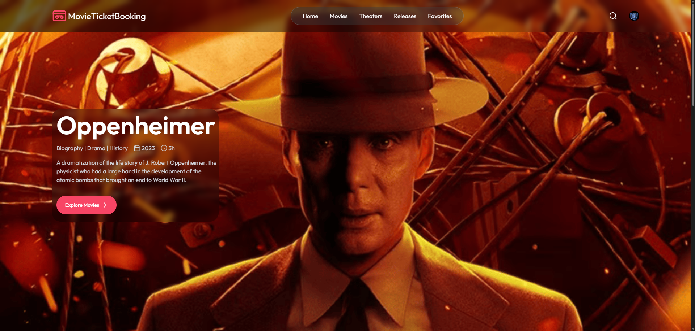

# 🎬 MovieTicketBooking

A full-stack movie ticket booking web application that allows users to browse movies, view showtimes, book tickets, and receive notifications. The app features secure authentication, real-time event handling, email notifications, and online payments.

## 🌐 Live Demo

Deployed on [Vercel](https://movie-ticket-booking-blond.vercel.app/)

---

## 📌 Features

- 👤 User authentication and session management (via [Clerk](https://clerk.dev))
- 🎟️ Movie and show browsing
- 🪑 Seat selection and booking
- 💳 Secure online payments via [Stripe](https://stripe.com)
- 📩 Email notifications for:
  - Ticket booking confirmation
  - New show/movie announcements
  - Showtime reminders
- ⚡ Event-driven architecture using [Inngest](https://www.inngest.com)
- 📧 Email delivery via [Brevo (formerly Sendinblue)](https://www.brevo.com)
- 🎨 Beautiful responsive UI with **React** and **Tailwind CSS**
- 🚀 Fully deployed on **Vercel**

---

## 🛠 Tech Stack

### Frontend
- [React](https://react.dev)
- [Tailwind CSS](https://tailwindcss.com)
- [Vite](https://vitejs.dev)
- [Clerk](https://clerk.dev) for user auth

### Backend
- [Node.js](https://nodejs.org)
- [Express](https://expressjs.com)
- [MongoDB](https://www.mongodb.com) via [Mongoose](https://mongoosejs.com)
- [Inngest](https://www.inngest.com) for background jobs/event triggers
- [Brevo](https://www.brevo.com) for sending transactional emails
- [Stripe](https://stripe.com) for payment integration

### Deployment
- Frontend + Server: [Vercel](https://vercel.com)
- Database: MongoDB Atlas or local MongoDB

---

## 📷 Screenshots

_Landing Page_

## 📦 Installation

### 📦 Prerequisites

Before you begin, make sure you have the following installed:

* [Node.js](https://nodejs.org/) (v18 or above)
* [MongoDB](https://www.mongodb.com/) (local or hosted via MongoDB Atlas)
* [Git](https://git-scm.com/)
* Accounts and API keys from:

  * [Clerk](https://clerk.dev) – for authentication
  * [Stripe](https://stripe.com) – for payments
  * [Inngest](https://www.inngest.com) – for background jobs
  * [Brevo](https://www.brevo.com) – for sending emails

---

### 🔽 1. Clone the Repository

```bash
git clone https://github.com/your-username/movieticketbooking.git
cd movieticketbooking
```

---

### 🔐 2. Set Up Environment Variables

Create `.env` files in both the `server` and `client` directories.

#### 📁 server/.env

```env
PORT=5000
MONGO_URI=your_mongodb_connection_string
CLERK_SECRET_KEY=your_clerk_secret_key
BREVO_API_KEY=your_brevo_api_key
STRIPE_SECRET_KEY=your_stripe_secret_key
INGGEST_EVENT_KEY=your_inngest_event_key
FRONTEND_URL=http://localhost:5173
```

#### 📁 client/.env

```env
VITE_CLERK_PUBLISHABLE_KEY=your_clerk_publishable_key
VITE_INGGEST_EVENT_URL=https://api.inngest.com/fn/<your-function-id>
VITE_STRIPE_PUBLISHABLE_KEY=your_stripe_publishable_key
```

Replace all placeholder values (`your_*`) with your actual API keys and URLs.

---

### 📥 3. Install Dependencies

#### Backend (Express server)

```bash
cd server
npm install
```

#### Frontend (React + Vite)

```bash
cd ../client
npm install
```

---

### ▶️ 4. Start Development Servers

#### Start the Backend

```bash
cd server
npm run dev
```

#### Start the Frontend

```bash
cd ../client
npm run dev
```

---

### 🌐 5. Open the App

Once both servers are running, open your browser and go to:

```
http://localhost:5173
```

---

✅ You're all set! You can now browse movies, book tickets, and test the full functionality of your MovieTicketBooking web app locally.